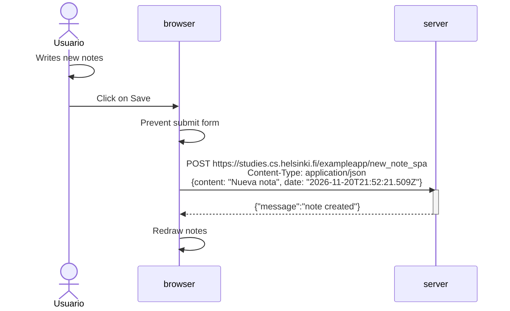

```mermaid
    sequenceDiagram
        actor user as Usuario
        participant browser
        participant server

        user->>user: Writes new notes
        user->>browser: Click on Save

        browser->>browser: Prevent submit form 
        browser->>server: POST  https://studies.cs.helsinki.fi/exampleapp/new_note_spa<br />Content-Type: application/json <br/>  {content: "Nueva nota", date: "2026-11-20T21:52:21.509Z"}
        activate server
        server-->>browser: {"message":"note created"}
        deactivate server
        browser->>browser: Redraw notes 
```